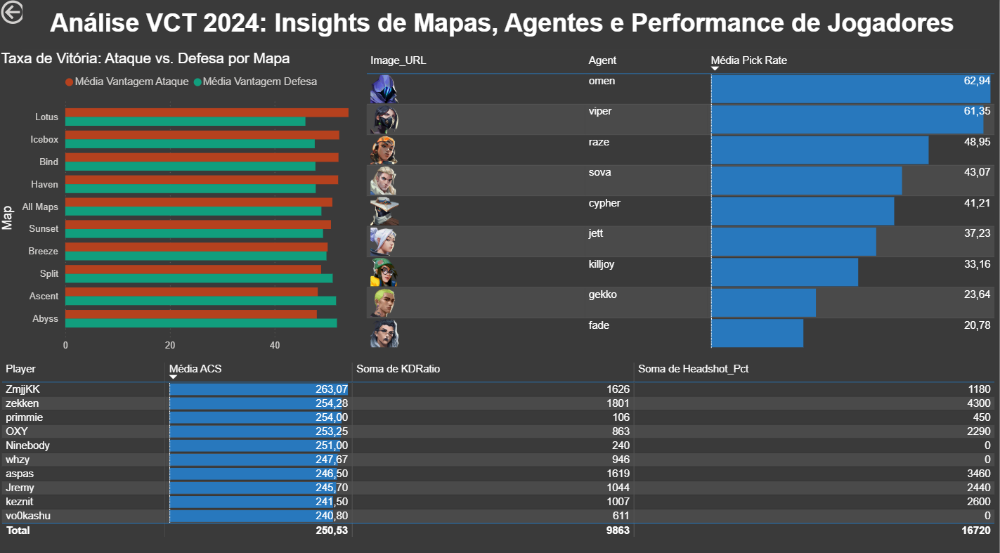

# Análise VCT 2024: Insights de Mapas, Agentes e Jogadores

## 📖 Sobre o Projeto

Este projeto é uma análise completa de dados do Valorant Champions Tour (VCT) 2024. O objetivo é utilizar Python para tratamento de dados (ETL) e o Power BI para visualização e geração de insights de negócio (Business Intelligence) sobre o cenário competitivo do jogo.

Este portfólio demonstra habilidades em todo o pipeline de análise de dados, desde a limpeza de dados brutos até a criação de um dashboard interativo.

---

## 🚀 Ferramentas Utilizadas

* **Linguagem:** Python
* **Bibliotecas (Limpeza e Análise):** Pandas
* **Visualização e BI:** Microsoft Power BI
* **Fonte dos Dados:** Kaggle (VCT 2021-2025 Data)

---

## 📊 Processo de Análise

1.  **Extração e Carga (Python):** Os dados brutos (`.csv`) do VCT 2024 foram carregados usando a biblioteca Pandas.
2.  **Transformação e Limpeza (Python):**
    * Colunas de porcentagem (ex: 'Pick Rate', 'Headshot %') foram convertidas de texto (ex: "55%") para formato numérico (ex: 55).
    * Valores ausentes (NaN) foram tratados.
    * Colunas-chave (como `Agent`) foram padronizadas (minúsculas e sem espaços) para permitir o relacionamento correto no Power BI.
3.  **Exportação:** Os 3 datasets limpos (`mapas_limpo.csv`, `agentes_limpo.csv`, `jogadores_limpo.csv`) foram salvos em uma pasta separada (`dados_limpos`).
4.  **Modelagem e Visualização (Power BI):**
    * Os dados limpos foram importados para o Power BI.
    * Um modelo de dados foi criado para relacionar a tabela de agentes com suas respectivas URLs de imagem (Relação 1:N).
    * Medidas DAX (ex: `AVERAGE`) foram criadas para calcular as médias de Pick Rate e ACS.
    * Visuais interativos foram criados para responder às perguntas de negócio.

---

## 💡 Principais Descobertas (Insights)

* **Desequilíbrio de Mapas:** A maioria dos mapas do VCT 2024 (como Ascent, Icebox e Sunset) demonstrou uma leve vantagem para o lado Defensor, o que é esperado em um jogo tático. A análise destacou dois mapas como "pontos fora da curva": Bind e Split. Nesses mapas, o lado Atacante mostrou uma taxa de vitória significativamente maior, indicando que as estratégias de ataque nestes mapas foram mais eficazes que as defesas.

* **Popularidade de Agentes:** A análise de taxa de escolha (Pick Rate) é clara: Omen (62.9%) e Viper (61.3%) foram os agentes mais dominantes do torneio. Ter pelo menos um deles (ou ambos) em uma composição foi quase obrigatório, mostrando um meta focado em controle de visão e área.
Entre os duelistas, Raze (48.9%) foi visivelmente mais popular que Jett (37.2%). Isso sugere que a utilidade explosiva e a capacidade de criar espaço da Raze foram mais valorizadas pelas equipes do que a mobilidade pura da Jett neste meta.

Já entre os sentinelas, o Cypher (41.2%) teve uma taxa de escolha mais alta que Killjoy, indicando uma preferência por coleta de informação em tempo real.
* **Performance de Jogadores:** A tabela "Top 10 Players" (filtrada por jogadores com mais de 100 rodadas) identifica os jogadores com maior impacto em combate (ACS). Jogadores como ZmjjKK e zekken consistentemente apareceram no topo, mostrando-se os "fraggers" mais eficazes do torneio.

**Espero que tenham gostado desse projetinho que junta a área pela qual me dedico e minha paixão por games. Muito obrigada!**